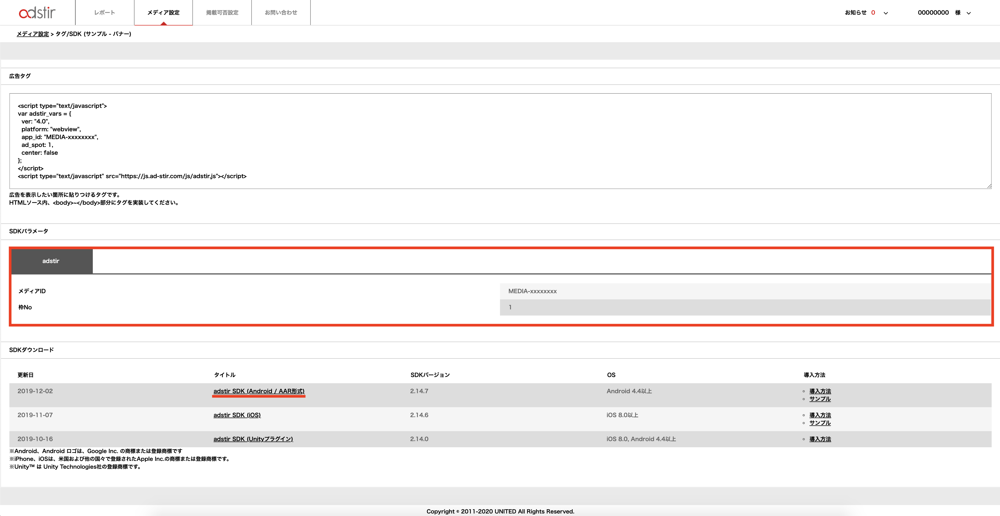
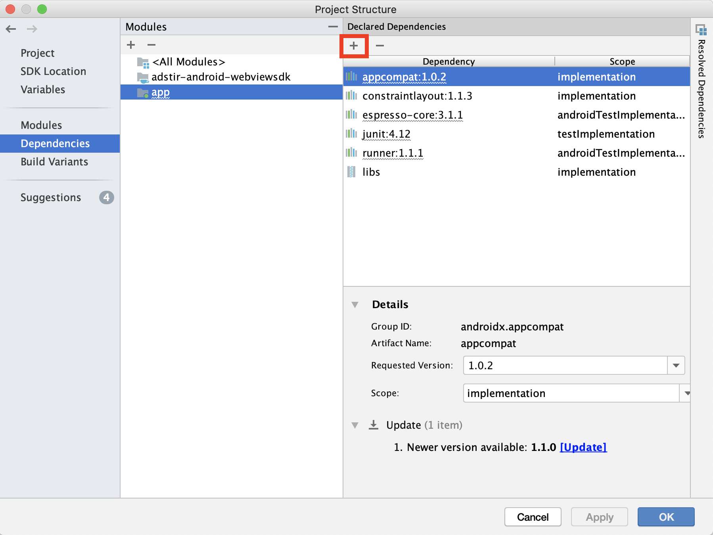

# SDKの手動組み込み

!!! Info
    バナー広告のみをご利用で手動で組み込む場合は営業担当までお問い合わせください

## SDKの準備
1. 管理画面にログインして、対象の枠の「タグ/SDK」を選択してください。


2. 「SDKダウンロード」より「AdStir SDK(Android)」をダウンロードしてください。

3. 「SDKパラメータ」より「メディアID」および「枠No」を取得してください。


## プロジェクトへのadstir SDKの追加

以前のバージョンのSDKを利用されている場合は、必ず関連するファイルを全て削除してください。

1. [SDKの準備](#sdkの準備)でダウンロードした圧縮ファイルを展開してください。
1. 展開したフォルダの中にある .aarファイルを「File -> New -> New Module -> Import JAR / AAR Package」よりインポートしてください。

1. 「File -> Project Structure -> Dependencies -> app」に、2.でインポートしたモジュールを追加してください。


## Google Play Servicesの追加
本SDKでは、[Google Play services](https://developer.android.com/google/play-services/index.html)の機能を使用しています。  
アプリケーションレベルのbuild.gradleに依存関係を設定します。
`play-services-ads-identifier`のバージョンは15.0.0以降をご利用ください。

```groovy hl_lines="1 3"
dependencies {
    implementation 'com.google.android.gms:play-services-ads-identifier:x.x.x'
}
```

## androidx.activityの追加
本SDKでは、[androidx.activity](https://developer.android.com/jetpack/androidx/releases/activity)の機能を使用しています。  
アプリケーションレベルのbuild.gradleに依存関係を設定します。
`androidx.activity`のバージョンは1.4.0以降をご利用ください。

```groovy hl_lines="1 3"
dependencies {
    implementation "androidx.activity:activity:x.x.x"
}
```