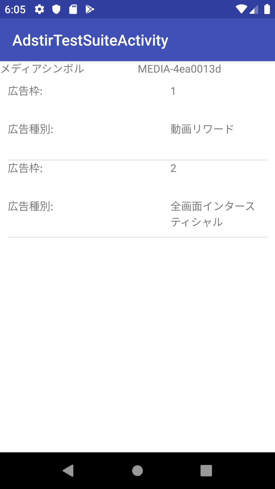
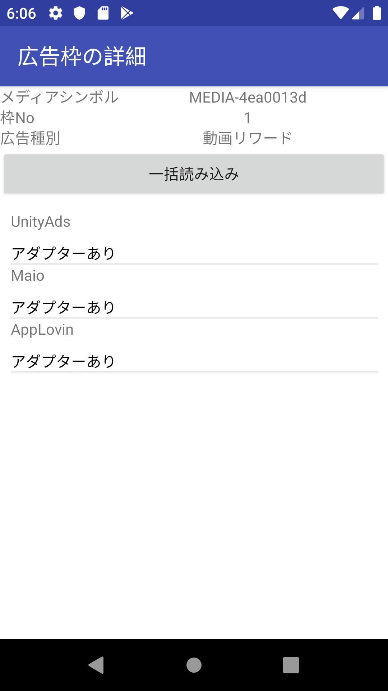
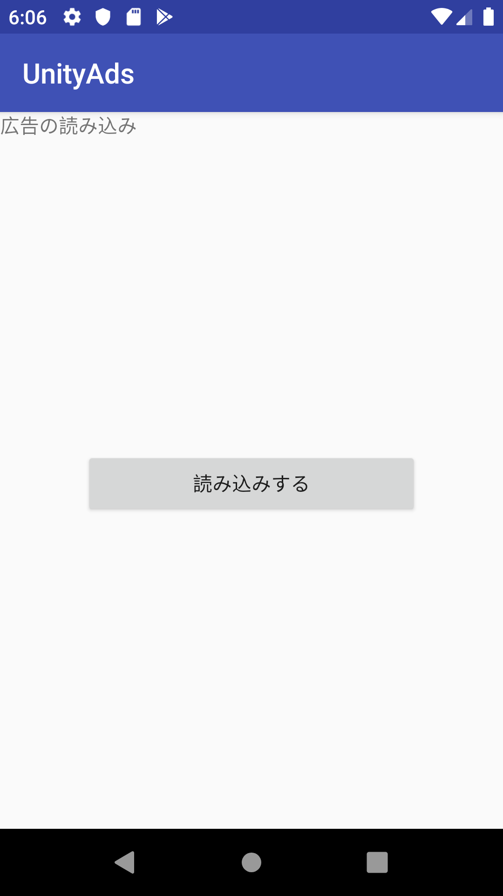

# adstirテストスイート

adstirテストスイートを利用することで、提携対応ネットワークのSDKとそのアダプターが、アプリに組み込まれていることを確認することができます。

## 前提条件

* Android 4.4以上
* Android Studio 3.2以上
* minSdkVersion 14以上
* compileSdkVersion 28以上
* AndroidX 必須

!!! Info
    アプリケーションをリリースする前にはadstirテストスイートのライブラリを削除をしてリリースをするようにお願いします。

### 対応広告

* 動画リワード
* 全画面インタースティシャル

## アプリケーションへの組み込み

### gradle

アプリケーションレベルのbuild.gradleにmavenリポジトリと依存関係を設定します。

```groovy hl_lines="6 8"
repositories {
    google()
    maven { url 'https://cdnp.ad-stir.com/m2' }
}

dependencies {
    implementation "com.ad-stir.libs.test:adstir-android-test-suite:1.0.0"
}
```

## テストスイートの起動

`AdstirVideoAds.init()`で利用しているメディアシンボルと、枠Noを引数で渡し、テストスイートを起動します。

```java
int[] spotIds = {1, 2, 3, 4};
AdstirTestSuite.launchTestSuite(MainActivity.this, "MEDIA-XXXX", spotIds);
```

`launchTestSuite()`で指定した広告枠のリストが下記のように表示されます。



広告枠をタップすると、下記の画面に遷移します。
こちらの画面では、広告枠に対する下記の点を確認することができます。

* 広告枠に設定されている提携対応ネットワーク
* アダプター/SDKがアプリに導入されているか
* 広告の読み込みの可否

「一括読み込み」ボタンを押すことで、各提携対応ネットワークの読み込みを行い、広告表示が可能になったネットワークには「読み込み完了」と表示されます。



アドネットワーク名をタップすることで下記の画面に遷移します。

「読み鋳込みする」ボタンをタップすることで、表示中のネットワークの広告を読み込みます。
読み込みが完了すると、「広告表示」に表記が代わり、このボタンをタップすることで広告の表示を確認することができます。



